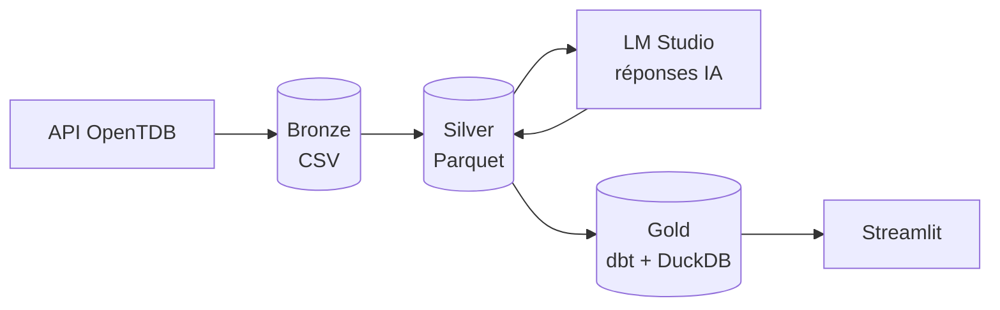

# Trivia LLM Benchmark

Évaluer la culture générale d'un modèle d'IA local, de la collecte des questions jusqu'au dashboard.

Projet M1 Data Engineering — EFREI Paris (octobre 2026)
**Salma EL-ODMI** et **Yara Elmawla**

## Le projet

Avant d'utiliser un modèle d'IA, une entreprise doit savoir à quel point il est fiable. Ce projet construit un **benchmark** : on pose 5 298 questions de culture générale à un modèle exécuté localement, on corrige automatiquement ses réponses, puis on analyse ses forces et ses faiblesses.

**Résultat principal** : Qwen 2.5 1.5B répond juste à **54,7 %** des questions (±1,3), soit **+26 points au-dessus du hasard**. Il est fort en savoir encyclopédique (Art 85 %, Sciences 76 %) et faible en culture populaire (Jeux vidéo 36 %, Anime 37 %).

## Questions métier

Le benchmark est construit pour répondre à des questions précises. Chacune correspond à une table de la couche gold et à un onglet du dashboard.

| Question métier | Table gold |
|---|---|
| Quel est le niveau global du modèle, et fait-il mieux que le hasard ? | `mart_perf_global` |
| Sur quels thèmes est-il fort ou faible ? | `mart_perf_by_category` |
| Quels thèmes pèsent le plus dans ses erreurs ? | `mart_perf_by_category` |
| Sa précision chute-t-elle avec la difficulté ? | `mart_perf_by_difficulty` |
| Comment le score évolue-t-il par thème et par difficulté ? | `mart_perf_by_category_difficulty` |
| Réussit-il mieux les QCM ou les vrai/faux ? | `mart_perf_by_type` |
| Réussit-il mieux les questions courtes ou longues ? | `mart_perf_by_question_length` |
| Choisit-il certaines lettres par réflexe (biais de position) ? | `mart_position_bias` |
| Met-il plus de temps quand il se trompe ? | `mart_response_time` |
| À quoi ressemblent concrètement ses erreurs ? | `mart_error_examples` |
| Sur quoi porte exactement le benchmark ? | `mart_benchmark_scope` |

---


## Architecture

```
trivia-pipeline-llm/
├── app/
│   └── streamlit_app.py            # dashboard (lit uniquement la couche gold)
├── data/
│   ├── bronze/
│   │   ├── raw/                    # réponses brutes de l'API, une par appel (source de vérité)
│   │   ├── questions_raw.csv       # livrable bronze
│   │   ├── scrape_report.json      # réconciliation avec le nombre officiel de questions
│   │   └── state.json              # token et avancement (reprise du scraping)
│   └── silver/
│       ├── questions_clean.parquet # questions nettoyées
│       ├── questions_rejected.csv  # questions écartées et raison
│       ├── clean_report.json       # rapport de qualité du nettoyage
│       └── ai_responses/           # réponses du modèle, par lots de 50
├── docs/                           # documentation détaillée et résultats des tests
├── src/
│   ├── ingestion/
│   │   └── scrape_opentdb.py       # BRONZE : collecte de l'API
│   ├── processing/
│   │   ├── clean_questions.py      # SILVER : nettoyage et normalisation
│   │   ├── prompts.py              # versions de prompt et correction des réponses
│   │   ├── test_models.py          # test préliminaire des modèles et des prompts
│   │   └── run_benchmark.py        # SILVER : enrichissement par IA
│   └── models/                     # GOLD : modèles dbt
│       ├── sources.yml
│       ├── staging/
│       ├── intermediate/
│       └── marts/
├── warehouse/
│   └── trivia.duckdb               # base gold
├── dbt_project.yml
├── profiles.yml
├── requirements.txt
└── .env.example
```




| Couche | Contenu | Script |
|---|---|---|
| **Bronze** | `questions_raw.csv` : 5 298 questions brutes | `src/ingestion/scrape_opentdb.py` |
| **Silver** | `questions_clean.parquet` + réponses du modèle (`ai_answer`, `ai_correct`, `response_time`) | `src/processing/clean_questions.py`, `run_benchmark.py` |
| **Gold** | `trivia.duckdb` : staging → intermediate → 10 marts | `src/models/` (dbt) |
| **Dashboard** | un onglet par question métier | `app/streamlit_app.py` |

## Méthodologie

**Collecte robuste** : token de session pour éviter les doublons, sauvegarde de chaque réponse de l'API avant de continuer, reprise après interruption, nouvelles tentatives en cas d'erreur réseau. 5 298 questions uniques sur 5 299 annoncées (1 doublon dans la source).

**Prompts** : 3 versions testées sur 3 modèles et 20 questions (question ouverte, QCM avec lettres, QCM sans lettres). Ce test a révélé un **biais de position** : Llama 3.2 choisit la première option 90 % du temps avec des lettres, contre 21 % sans lettres.

**Benchmark** :
- **Expérience A** : Qwen 2.5 1.5B, QCM avec lettres, **les 5 298 questions** (8 h 41, 0 erreur)
- **Expérience B** : 2 modèles × 2 prompts sur 300 questions communes *(en cours )*

Température 0 et choix mélangés dans un ordre fixe : les résultats sont reproductibles.

**Lecture des résultats** : chaque score est affiché avec le **score du hasard** (25 % en QCM, 50 % en vrai/faux) et une **marge d'erreur à 95 %**.

## Résultats (expérience A)

| Difficulté | Précision | | Type | Précision | Gain sur le hasard |
|---|---|---|---|---|---|
| easy | 63,0 % ±2,2 | | QCM | 53,4 % | +28,4 pts |
| medium | 50,7 % ±2,0 | | Vrai/faux | 62,0 % | +12,0 pts |
| hard | 50,0 % ±2,9 | | | | |

- Medium et hard ne se distinguent pas (marges qui se chevauchent).
- Le vrai/faux paraît plus facile, mais le modèle apporte plus du double de valeur en QCM.
- Même temps médian (2,87 s), mais les réponses fausses ont plus de cas lents.

## Installation

```powershell
git clone https://github.com/ELODM/trivia-pipeline-llm.git
cd trivia-pipeline-llm
python -m venv .venv
.venv\Scripts\Activate.ps1
pip install -r requirements.txt
copy .env.example .env
```

Dans **LM Studio** : télécharger `Qwen2.5-1.5B-Instruct` et `Llama-3.2-1B-Instruct` (Q4_K_M), puis démarrer le serveur (onglet Developer).

```powershell
python src/ingestion/scrape_opentdb.py                 # bronze
python src/processing/clean_questions.py               # silver : nettoyage
python src/processing/run_benchmark.py --models qwen2.5-1.5b-instruct --prompts v2_mcq_letter --sample all
dbt run --profiles-dir .                               # gold
streamlit run app/streamlit_app.py                     # dashboard
```

Les données sont versionnées : le dashboard peut être lancé directement, sans relancer le benchmark.

## Conformité à l'énoncé

| Exigence | Réalisation |
|---|---|
| Dataset OpenTDB complet | 5 298 questions |
| Modèle local via API (LM Studio) | Qwen 2.5, Llama 3.2, Qwen 3.5 |
| `ai_answer`, `ai_correct`, `response_time` | dans les Parquet silver |
| Prompts standardisés et variantes | 3 versions, trace conservée |
| Bronze CSV, silver Parquet, gold DuckDB | ✅ |
| staging / intermediate / mart avec dbt | ✅ |
| Dashboard Streamlit | ✅ |

## Binôme

| Membre | 
|---|---|
| Salma EL-ODMI | 
| Yara Elmawla | 

## Sources

- Données : [Open Trivia Database](https://opentdb.com), licence CC BY-SA 4.0
- Scraping inspiré de [OTDB-Source](https://github.com/MrSossidge/OTDB-Source)
